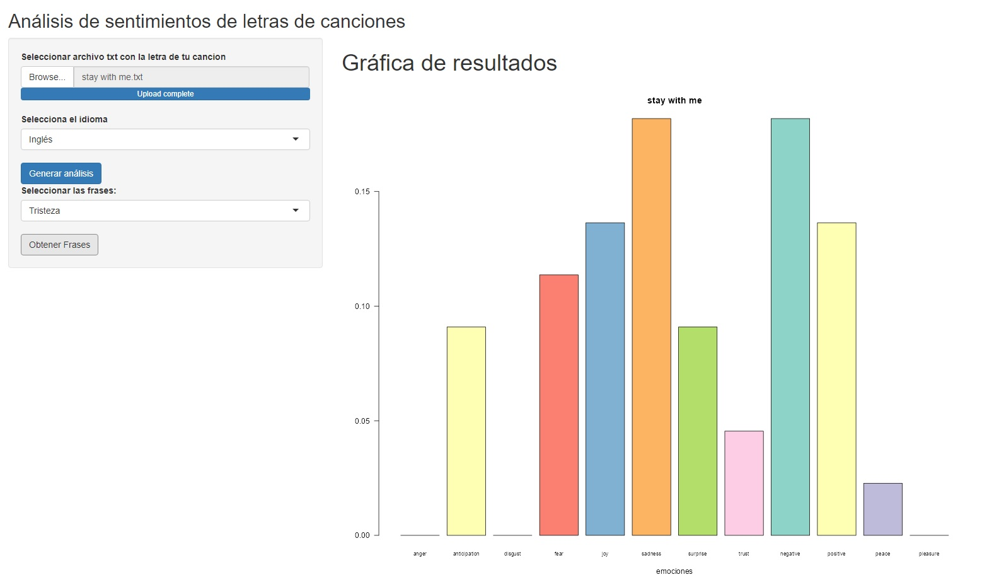
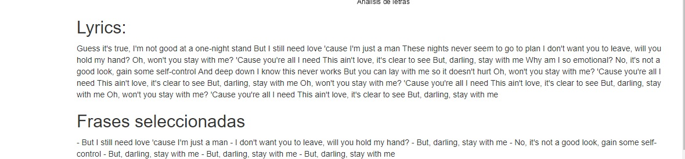

# AnalisisCancionesSentimiento

## Resumen
El proyecto está enfocado en obtener un análisis de sentimientos de la letra de una cancion. Las emociones que detecta son enojo, anticipación, disgusto, miedo, alegría, tristeza, sorpresa, confianza, paz y placer. También clasifica las frases en negativas y positivas. La aplifación funciona con letras en inglés y en español y solamente se ocupa subir la letra en un archivo de txt.

Al final de la ejecución, podemos elegir un sentimiento y obtener que frases fueron clasificadas con ese sentimiento. Una misma frase puede estar clasificada en varios sentimientos.

La librería que utilicé es NRC sentiment incluida en el paquete syuzhet. La librería soporta el idioma inglés y español, sin embargo, el idioma español está poco trabajado y no soporta las conjugaciones de las palabras en español.  

## Retos
Ya que la librería no soporta completamente el lenguaje español, tuve realizar un web scrapping a la real academia española para extraer la palabra neutra en caso de que en la letra esté conjugada, para esto se hizo.
  - Crear un script en python para realizar el web scrapping utilizando selenium.
  - Incluir la librería reticulate en el módulo de R para poder ejecutar el script de python.
  - Crear un JSON llamado diccionario para guardar todas las palabras nuevas que se obtengan y así no tener que hacer el web scrapping cada vez que aparezca una palabra que no soporte la libreía. El diccionario se guarda de     manera local y se actualiza con cada palabra nueva encontrada.
 
 Otro reto fueron las frases que contenían conectores negativos. Los conectores son palabras que le dan un mayor significado a las frases, en este caso los negativos son palabras que cambian el significado de las frases, ejemplos: no, nunca, jamás, etc. Esto porque la libería no detecta estas palabras. Para resolver este caso y tener resultados mas acordes se hizo lo siguiente:
 - Se creó una lista con los conectoros negativos más populares en las canciones.
 - Utilizamos REGEX para encontrar si alguna palabra en la frase es un conector negativo con base a la lista creada.
 - Al encontrar uno, invertimos todos los sentimientos que ya se habían calculado para esa frase, es decir, si la frase tenía como resultado alegría entonces la cambiamos a tristeza.
